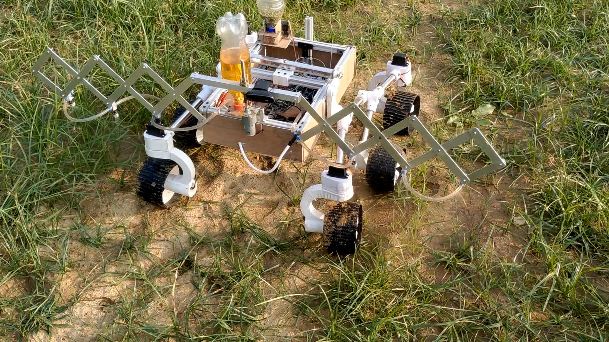
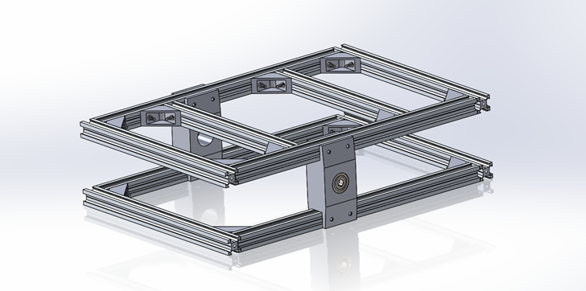
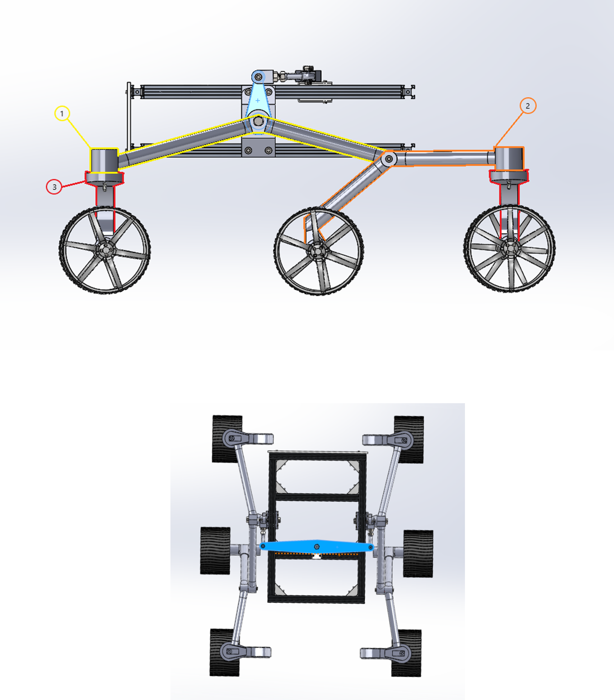
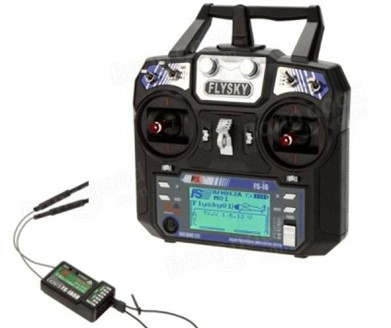

# Agri-bot

**Video Link**:https://youtu.be/vjN9Gbcwcw8

The Agri-Bot is a robot designed to perform several agricultural operations like sowing seeds, spraying weedicides and detecting disease in crops. Its body is inspired by the space rovers so that it can cover any kind of uneven surfaces in the field and be lightweight at the same time. The robot was first designed in Solidworks and then built with some parts being 3-D printed and some made with aluminum. 

## INTRODUCTION

It is a six-wheel drive which is steered with the help of four servo motors at the front and the rear wheels. It is operated by RC control to m1ove along the field.

The seed sowing mechanism has a tooth that drags along the soil to make a groove in the soil in which the seed dropper places the seeds.

The weedicide sprayer has spray nozzles with variable distances between them which can be varied using the RC control. In this way we can ensure minimum wastage of weedicide and optimum coverage.

## MECHANICAL ASPECT

**Chassis**

The main body of the rover is built up using aluminum T slots as frames. It consists of a top and a bottom frame connected using a metal connector where the rocker bogie would be attached. Each rectangular frame is made up using 2 different pipes of length 42 cm and 29 cm. The top and bottom are attached with each other through a 3-D printed connector. The lower part is covered with wooden base. 

**Rocker Bogie**

It is a special suspension system which keeps the robot stable while traversing and ensures that all wheels keep contact with the ground. Each side has a rocker which is made with four pipes attached with 3-D printed connectors. Both rockers are connected through a differential which moves both rockers in a way such that the chassis remains stable. The special arrangement of the rocker wheels which have the middle and rear wheels freely always moving on a pivot lead to maximum wheel contact.

**Wheels and steering**

The wheels are fully 3-D printed with motors attached to each of the wheels. Servos are attached to the front and the rear wheels which can rotate the wheels. We have chosen to use servos on both front and rear wheels to minimize the turn radius and for better steering.

**Seed sowing mechanism**

The seeds come from a funnel to the seed dropper which ensures regulated flow of seeds. The dropper contains a rotating wheel with has hollow section which brings the seeds to the pipe in a controlled manner. The wheel is attached to a servo motor which rotates the wheel. A tooth continues to drag in the soil making a groove in which the seed comes through a pipe and gets dropped into the soil. The speed of the servo can be controlled which enables us to control the distance between the dropping of the seeds.

## ELECTRONICS ASPECT

**RC CONTROL**

The robot is controlled by Flysky FS-i6 transmitter and the signals are received by a 2.4 GHz 6-Channel FS-iA6B receiver. In normal driving mode, the robot is moved by 60rpm 12V DC motors connected to each wheel. In steering mode, the 15 Kg torque servo motors attached to the front and rear wheels get rotated causing the robot to turn. 

**DISEASE DETECTION IN CROPS**

We have implemented disease detection in maize crop by the help of Image Classification in python with 91% validation accuracy. This was done with the help of Tensorflow library and the training was done in a laptop taking around half an hour. The dataset was taken from Kaggle which goes by the name of New Plant diseases Dataset in which the images already are data augmented and we can classify them to identify three types of diseases in maize(corn) namely Cercospora/Gray leaf spot, 
Common Rust and Northern Leaf Blight. It can also show that the crop is healthy and free from diseases. Coming to more technicalities of the model, it uses adam optimizer and Sparse Categorical Cross Entropy as the loss function.

It is finally implemented with the help of an on-board Raspberry Pi and Logitech Webcam connected to it which sends the video input. Opencv is used to take each frame and preprocess it. Afterwards, the model is loaded and the predictions are run. The Video output has the disease written on it or it writes Healthy. The video output can be stored in the memory and later seen by connecting the raspberry pi to a visual monitor.

